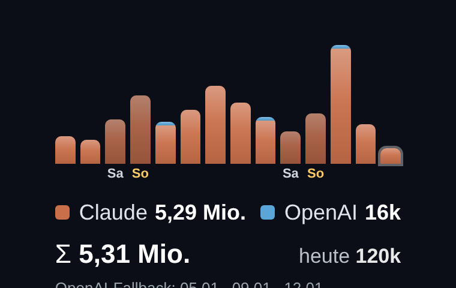

# MMM-TokenUsage

A [MagicMirror²](https://magicmirror.builders/) module that shows **daily AI token usage**
as stacked gradient bars over the last two weeks — one series for Claude, one for OpenAI —
plus a legend, a total and a "today" figure. Weekends are marked and any provider-fallback
days are listed.



The module is a **pure renderer**: you feed it a `data.json` (e.g. produced by your own
token-tracking script / cron job). A sample `data.json` is included so it works out of the box.

## Installation

```bash
cd ~/MagicMirror/modules
git clone https://github.com/ago1776/MMM-TokenUsage
```

```js
{
  module: "MMM-TokenUsage",
  position: "top_right",
  header: "AI Usage · 14 days",
  config: { }
}
```

## Data format (`data.json`)

Place a `data.json` in the module folder (your feeder overwrites it):

```json
{
  "generated": "2026-01-14 07:00",
  "claude_daily": [210000, 180000, 340000, "… 14 values, oldest → newest"],
  "openai_daily": [0, 0, 0, "… 14 values"],
  "fallback_days": ["05.01.", "09.01."]
}
```

- `claude_daily` / `openai_daily`: arrays of equal length (e.g. 14), oldest day first.
- `generated`: timestamp of the newest day (used to place weekday markers).
- `fallback_days`: optional list of dates shown as a footnote.

## Configuration options

| Option           | Type   | Default              | Description                                 |
| ---------------- | ------ | -------------------- | ------------------------------------------- |
| `header`         | string | `"AI Usage · 14 days"` | Module header (via MagicMirror `header`). |
| `updateInterval` | number | `900000` (15 min)    | How often `data.json` is re-read (ms).      |
| `barMaxHeight`   | number | `96`                 | Height of the tallest bar in px.            |
| `colorClaude`    | string | `"#c96f4a"`          | Bar colour for the first series.            |
| `colorOpenAI`    | string | `"#5aa6d8"`          | Bar colour for the second series.           |

## License

MIT © Andreas Göpfert

